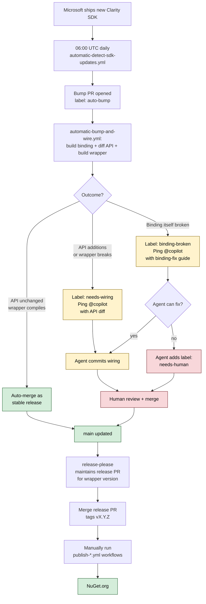

[](https://www.buymeacoffee.com/kebechet)

# Maui.MicrosoftClarity
[](https://www.nuget.org/packages/Kebechet.Maui.MicrosoftClarity/)
[](https://www.nuget.org/packages/Kebechet.Maui.MicrosoftClarity/)

[](https://x.com/samuel_sidor)

Wrapper for [Microsoft Clarity for mobile](https://clarity.microsoft.com/)

## Usage
Firstly register package installer in your `MauiProgram.cs`
```csharp
 builder.Services.AddMicrosoftClarity();
```

then in `App.xaml.cs` inject `MicrosoftClarityService`:
```csharp
public partial class App : Application {
    private readonly MicrosoftClarityService _microsoftClarityService;

    public App(MicrosoftClarityService microsoftClarityService) {
        InitializeComponent();
        _microsoftClarityService = microsoftClarityService;
    }
}
```
and also override there method `OnStart()` to call `_microsoftClarityService.Initialize` with your project id.

```csharp
protected override void OnStart() {
    _microsoftClarityService.Initialize("<MicrosoftClarityProjectIdHere>");

    base.OnStart();
}
```

## ⚠️ iOS Local debugging
Because of MAUI and VS bugs:
- https://github.com/xamarin/xamarin-macios/issues/19229
- https://developercommunity.visualstudio.com/t/MAUI---Cannot-create-native-types-when-d/10180586
- potential workaround: https://github.com/dotnet/maui/issues/10800#issuecomment-1301564278

it is not possible to run your app with hot-restart(direct local iOS deploy from VS for Windows)

## Dummy classes

So that you dont have to specify platform for this package and it's calls, also Windows and MacCatalyst are added with dummy implementations. When you call one of their methods you will always get:
- `true` for bool returns
- `new List<>` for collections
- `string.Empty` for string values

## Exception behavior
- Library will throw exceptions only in case developer did some mistake
- in other cases, when there is some corrupted state it will return default value of that type.

## Automated SDK updates

This repo runs a daily pipeline that watches Microsoft's Clarity Android and iOS SDKs and tries to bump + re-wire this package automatically. The flow:



The only manual steps for you:
1. Review and merge agent wiring PRs when `needs-wiring` is applied
2. Fix binding-generator failures the agent escalates as `needs-human` (rare)
3. Trigger the three `publish-*.yml` workflows after each release tag

See `.github/COPILOT_INSTRUCTIONS.md` for the rules the agent follows.

## Contributions
Feel free to create an issue or pull request. In case you would like to do massive changes in the package please firstly discuss them in the issue because otherwise there is high chance that such big PR would be rejected.

## License
This repository is licensed with the [MIT](LICENSE.txt) license.
