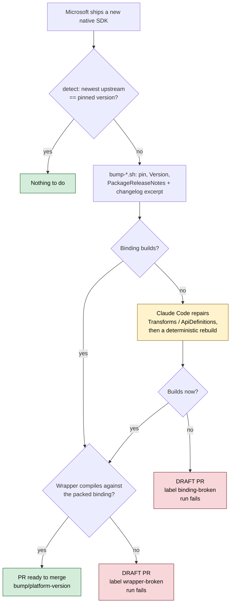

[](https://www.buymeacoffee.com/kebechet)

# Maui.MicrosoftClarity
[](https://www.nuget.org/packages/Kebechet.Maui.MicrosoftClarity/)
[](https://www.nuget.org/packages/Kebechet.Maui.MicrosoftClarity/)

[](https://x.com/samuel_sidor)

Wrapper for [Microsoft Clarity for mobile](https://clarity.microsoft.com/)

## Usage
Firstly register package installer in your `MauiProgram.cs`
```csharp
 builder.Services.AddMicrosoftClarity();
```

then in `App.xaml.cs` inject `IMicrosoftClarityService`:
```csharp
public partial class App : Application {
    private readonly IMicrosoftClarityService _microsoftClarityService;

    public App(IMicrosoftClarityService microsoftClarityService) {
        InitializeComponent();
        _microsoftClarityService = microsoftClarityService;
    }
}
```
and also override there method `OnStart()` to call `_microsoftClarityService.Initialize` with your project id.

```csharp
protected override void OnStart() {
    _microsoftClarityService.Initialize("<MicrosoftClarityProjectIdHere>");

    base.OnStart();
}
```

## ⚠️ iOS Local debugging
Because of MAUI and VS bugs:
- https://github.com/xamarin/xamarin-macios/issues/19229
- https://developercommunity.visualstudio.com/t/MAUI---Cannot-create-native-types-when-d/10180586
- potential workaround: https://github.com/dotnet/maui/issues/10800#issuecomment-1301564278

it is not possible to run your app with hot-restart(direct local iOS deploy from VS for Windows)

## Dummy classes

So that you dont have to specify platform for this package and it's calls, also Windows and MacCatalyst are added with dummy implementations. When you call one of their methods you will always get:
- `true` for bool returns
- `new List<>` for collections
- `string.Empty` for string values

## Exception behavior
- Library will throw exceptions only in case developer did some mistake
- in other cases, when there is some corrupted state it will return default value of that type.

## Automated SDK updates

Two independent workflows watch Microsoft's native Clarity SDKs and each turn a new
release into **one standalone pull request that is ready to merge when it opens**:

| Workflow | Watches | Runner |
|---|---|---|
| `TryBumpAndroid` (`.github/workflows/try-bump-android.yml`) | `com.microsoft.clarity:clarity` on Maven Central | ubuntu |
| `TryBumpIOS` (`.github/workflows/try-bump-ios.yml`) | `Clarity-<version>` in `microsoft/clarity-apps` `Package.swift` | macOS + Objective Sharpie |

Both run daily and on demand (`workflow_dispatch` takes an optional explicit version).
A run bumps the **binding** csproj only. The wrapper csproj is asserted byte-identical
before anything is committed, so `main` never references a binding that is not on
nuget.org yet.


```mermaid
flowchart TD
    A[Microsoft ships a new native SDK] --> B{detect: newest upstream<br/>== pinned version?}
    B -->|yes| Z[Nothing to do]
    B -->|no| C[bump-*.sh: pin, Version,<br/>PackageReleaseNotes + changelog excerpt]
    C --> D{Binding builds?}
    D -->|no| E[Claude Code repairs<br/>Transforms / ApiDefinitions,<br/>then a deterministic rebuild]
    E --> F{Builds now?}
    D -->|yes| G{Wrapper compiles against<br/>the packed binding?}
    F -->|yes| G
    F -->|no| H[DRAFT PR<br/>label binding-broken<br/>run fails]
    G -->|yes| I[PR ready to merge<br/>bump/platform-version]
    G -->|no| J[DRAFT PR<br/>label wrapper-broken<br/>run fails]

    classDef happy fill:#d4edda,stroke:#155724,color:#000
    classDef warn fill:#fff3cd,stroke:#856404,color:#000
    classDef bad fill:#f8d7da,stroke:#721c24,color:#000
    class I,Z happy
    class E warn
    class H,J bad
```

What a green PR guarantees: `<Version>` follows `<native>.<binding-rev>`,
`PackageReleaseNotes` starts with an entry for that version (with Microsoft's changelog
text when it is published), the binding builds, and the wrapper compiles against the
packed nupkg from a local feed. When Claude Code had to repair the binding sources the
PR carries the `claude-fixed` label and a summary of the edits - review those like any
hand-written change.

Secrets: `BUMP_BOT_APP_ID` / `BUMP_BOT_APP_PRIVATE_KEY` (the bot that pushes and opens
PRs) and `CLAUDE_CODE_OAUTH_TOKEN` (from `claude setup-token`; without it a broken
binding simply lands as a draft PR with the build log attached).

Merging and publishing the binding, and moving the wrapper onto it, are separate steps.

## Contributions
Feel free to create an issue or pull request. In case you would like to do massive changes in the package please firstly discuss them in the issue because otherwise there is high chance that such big PR would be rejected.

## License
This repository is licensed with the [MIT](LICENSE.txt) license.
